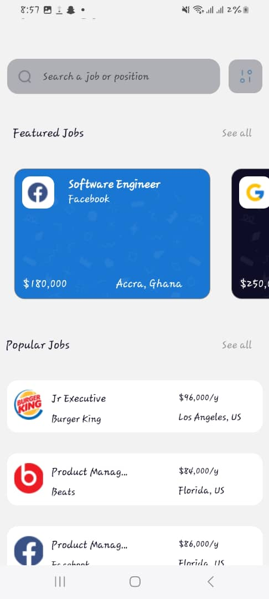

# RN Assignment 4 - 11232324

This is the repository for Assignment 4 fot the Mobile Application Development


## Components

### Signup 
- A screen that allows the users to enter their name and email and login

### HumeScreen 
- A screen that displays the user's name and email.
- Displays popular and featured job cards.

### PopularJob
- A reusable component that displays popular job details
  
### PopularJobCard
- A card that displays and accepts props for popular job title and description.

### FeaturedJob
- A reusable component that displays featured jobs.

### FeaturedJobCard
- A card that displays and accepts props for featured job title and description


## Screenshots





## How to Run

1. Clone the repository:
   ```bash
   git clone https://github.com/frankmawuli/rn-assignment4-11232324.git
   cd assignment4
